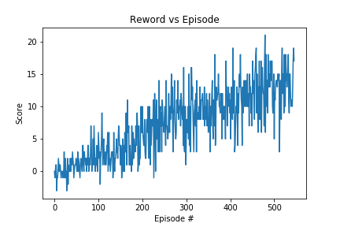

## Project 1: Navigation

### Learning Algorithm
The learning algorithm implemented in this project is Deep Q-Networks (DQN).   
The networks consists one input layer, one hidden layer and one output layer. The input to the neural network is a vector with length of 37 followed by application of a rectifier nonlinearity. The hidden layer is a fully connection layer and applies a rectifier nonlinearity. The output layer is a fully-connected linear layer with four output for each valid action.  
The network was trianed with the Adam algorithm with minibatches of size 32. The behaviour policy during training was e-greedy with e annealed linearly from 1.0 to 0.01 with discount rate 0.995, and fixed at 0.01 thereafter. The table 1 shows all hyperparameters in this algorithm.  
Here is the pseudocode:
```
Initialize hyperparameters
Initialize replay memory D to capacity N
Initialize action-value function Q with random weights h
Initialize target action-value function Q^ with weights h^=h
For episode = 1, M do
    init env and get the init state S;
    For t = 1,T do
        With probability e select a random action a; otherwise select action with max Q value generated from dqn networks;
        Execute action a in emulator and observe reward r, next state Sn, Done;
        Set state = next_state;
        Store action-state-reword paris in memory D;
        if UPDATE_NETWORKS:
            sample a minibatch of experience tuples from memory D;
            Get max predicted Q values (for next states) from target model;
            Compute Q targets for current states;
            Get expected Q values from local model;
            Compute loss;
            Minimize the loss;
            Update local model parameters h;
        if Done:
            break;
    End For
End For
```

| Hyperparameters   |      value      |
|----------|:-------------:|------:|
| replay buffer size |  100000 |
| minibatch size |    32   |
| discount factor | 0.99 |
| soft update of target parameters | 1e-3 |
| learning rate  | 5e-4 |
| eps_start  | 1 |
| eps_end  | 0.01 |
| eps_decay  | 0.995 |
| n_episodes  | 2000 |
| max_t  | 1000 |  

## Result

Environment solved in 446 episodes!	Average Score: 13.02 

## Future Work  
Here are some techniques may be useful to improve the performance:
- Double DQN
- Dueling DQN
- Using Prioritized Experience Replay
- Learning from multi-step bootstrap targets
- Distributional DQN
- Noisy DQN
